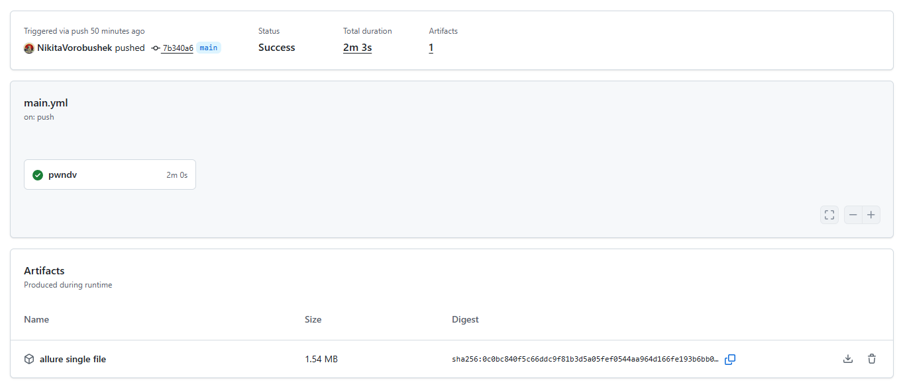
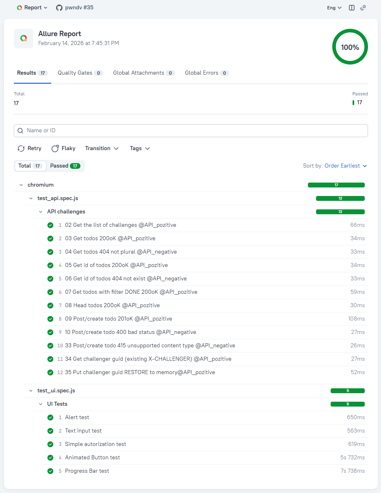
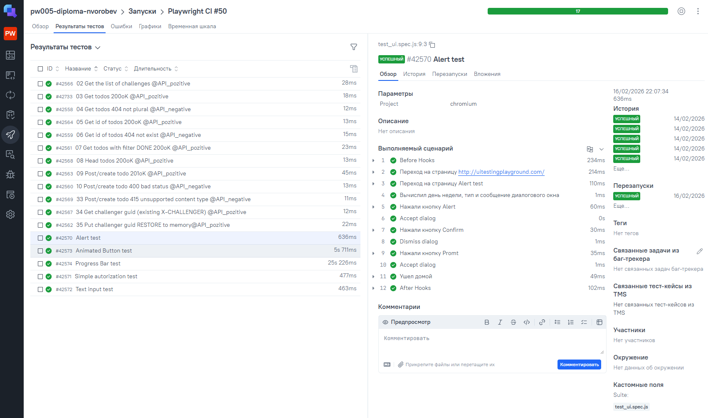
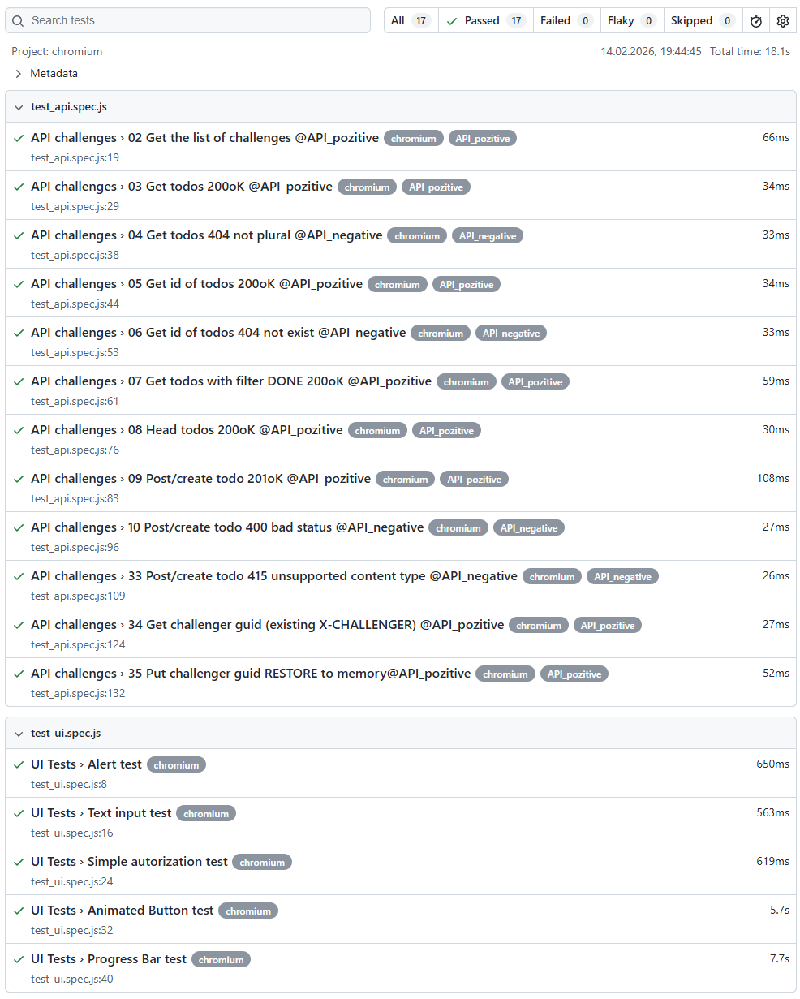
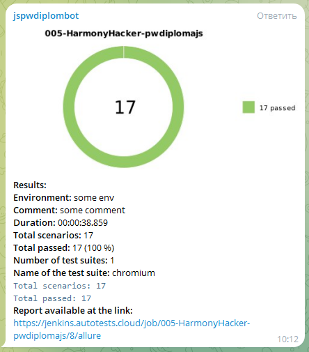

# 👨‍🎓 Дипломный проект: комплексное тестирование (Web, API)

## ✍️ Описание проекта
Этот репозиторий содержит автоматические тесты для:

- **UI**: [UI Test Automation Playground](http://uitestingplayground.com/) — сайт-эмулятор различных UI примочек.  
- **API**: [Apichallenges](https://apichallenges.herokuapp.com/gui/challenges) — сервис для проверки API-запросов и структуры данных.  

Цель проекта — обеспечить **надежную автоматизацию тестирования** как для пользовательского интерфейса, так и для API, с возможностью интеграции с CI/CD и визуализации отчетов.  

Проект интегрирован с:  
- **GitHub Actions** — автоматический запуск тестов при push и pull request  
- **Allure Report** — наглядная визуализация результатов тестов  
- **Allure TestOps** — хранение истории прогонов
- **Telegram** — автоматические уведомления о статусе тестов  

---

## 🛠 Технологический стек
      
- **Язык:** JavaScript  
- **Фреймворк для тестов:** Playwright  
- **CI/CD:** GitHub Actions  
- **Отчеты:** Allure Report + Allure TestOps  
- **Уведомления:** Telegram  

---

## 🖥 Тестируемое приложение

### 1️⃣ UI (UI Test Automation Playground)
Основные сценарии:
- Взаимодействие с диалоговыми окнами на странице
- Ввод текста в "поле для ввода"
- Простой пример авторизации пользователя
- Взаимодействие с анимированной кнопкой
- Взаимодействие с "полосой загрузки" и различным таймингом выполнения

### 2️⃣ API (Apichallenges)
Основные сценарии:
- GET-запрос для получения списка заданий
- GET-запросы для получения различных значений из endpoint (тело ответа есть)
- HEAD-запрос на получение различных метаданных из endpoint (тела ответа нет)
- POST-запрос на создание нового задания
- POST-запросы на разные ответы сервиса по созданию заданий
- PUT-запрос на сохранение временных данных

---

## 🔄 CI/CD и отчеты

- Все тесты запускаются автоматически при push через GitHub Actions.
- Результаты сохраняются как артефакты GitHub.
  
- Отчёты визуализируются с помощью Allure Report.  
  
- История прогонов передается в Allure TestOps для удобного анализа.  
  
- Классический вариант просмотра результатов теста в вэб-интерфейсе Playwright.  
    
  
---

## 📩 Уведомления в Telegram

- После каждого прогона тестов бот отправляет:
  - Текстовую сводку с количеством успешных, упавших и пропущенных тестов
  - Файл Allure отчёта в формате single-file  
    
- Для работы необходимо настроить:
  - `TELEGRAM_BOT_TOKEN` и `TELEGRAM_CHAT_ID` в secrets репозитория

## 🏃‍♂️ Run Guide
### 🔹 Запуск всех тестов
Запускает все тесты (`ui.spec.js` + `api.spec.js`).
```bash
npm t
```
### 🔹 Запуск тестов в режиме UI (Playwright Test Runner)
Запускает Playwright Test Runner в графическом интерфейсе (выбор тестов, наблюдение за прогрессом).
```bash
npm run ui
```
### 🔹 Генерация и просмотр отчетов Playwright
Открывает встроенный Playwright Reporter.
```bash
npm run report
```
### 🔹 Генерация и просмотр отчетов Allure
```bash
npm run allure:generate
```
### 🔹 Генерация и просмотр отчетов Allure в браузере
```bash
npm run allure:serve
```
### 🔹 Отправка отчетов в Allure TestOps (требуется настроить `ALLURE_ENDPOINT`, `ALLURE_TOKEN`, `ALLURE_PROJECT_ID`):
```bash
npm run allure:send
```
### 🔹 Отправка полного отчета по прогону в Telegram (требуется настроить `TELEGRAM_BOT_TOKEN`, `TELEGRAM_CHAT_ID`; должно быть наличие файла `allure-report/summary.json`):
```bash
npm run allure:telegram
```
